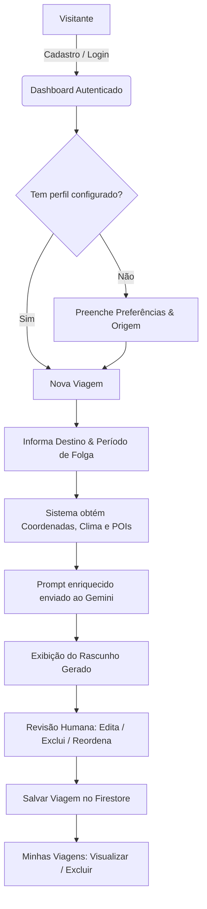
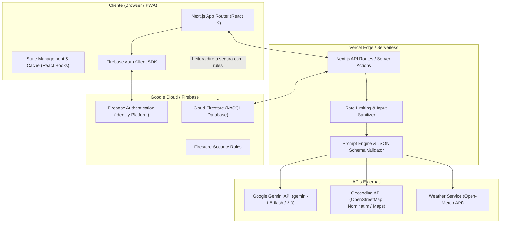
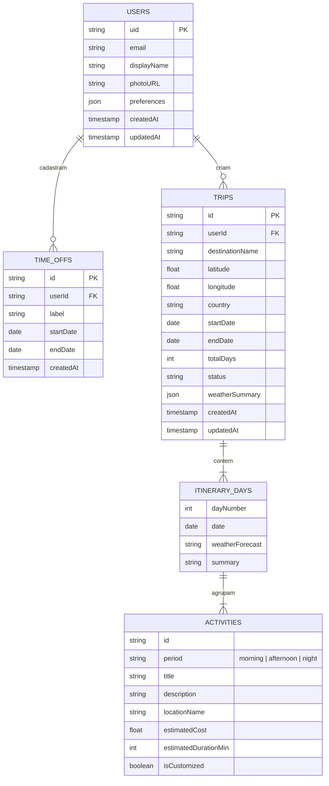
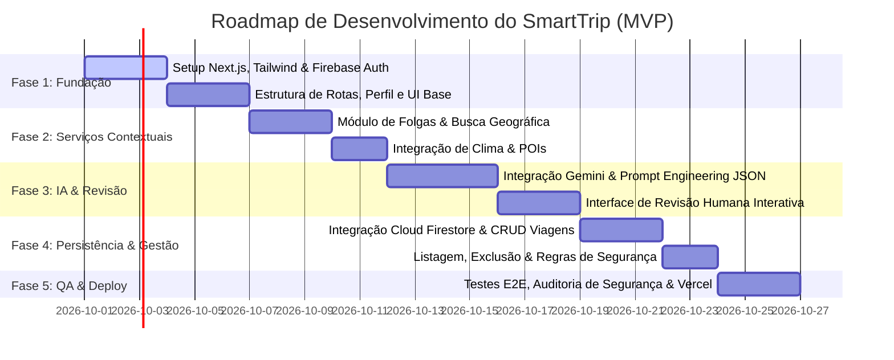

# SPEC MESTRE — SMARTTRIP

**Versão:** 1.0.0  
**Status:** Aprovado para Implementação  
**Autor:** Engenheiro de Produto & Arquiteto de Software (DeepMind / Antigravity)  
**Projeto:** Assistente Inteligente de Viagens (Projeto Final de IA Generativa)  
**Stack Tecnológica Base:** Next.js (React), Firebase Authentication, Cloud Firestore, Google Gemini API, Vercel  

---

## 1. Visão do Produto

O **SmartTrip** é um assistente inteligente de viagens projetado para transformar o processo fragmentado, demorado e exaustivo de planejamento de viagens em uma experiência ágil, personalizada e contextualizada em segundos.

Aliando a capacidade cognitiva e de síntese de Modelos de Linguagem Avançados (**Google Gemini**) com dados em tempo real de **geolocalização, condições climáticas e pontos de interesse (POIs)**, o SmartTrip gera roteiros dia a dia realistas e adaptados à disponibilidade temporal (folgas) e às preferências comportamentais de cada usuário.

Diferente de geradores de texto genéricos, o SmartTrip ancora o planejamento em restrições reais de calendário, geografia e meteorologia, oferecendo uma interface de **revisão humana ativa**, onde o viajante permanece no controle: edita, ajusta, regenera atividades específicas e consolida a versão final do seu roteiro.

---

## 2. Personas

### Persona 1: Juliana Mendes — A Profissional Sem Tempo
* **Perfil:** 32 anos, gerente de marketing, rotina intensa de trabalho em São Paulo.
* **Comportamento:** Tem apenas feriados prolongados ou períodos curtos de 3 a 7 dias de férias. Não tem 20 horas disponíveis para ler blogs, consultar guias e montar planilhas manuais.
* **Dores:** Dificuldade em conciliar horários com previsão de tempo e atrações abertas; frustração ao seguir roteiros inflexíveis de agências convencionais.
* **Objetivo no SmartTrip:** Inserir suas datas de folga e seu perfil (gastronomia e caminhadas culturais) e obter em menos de 1 minuto um roteiro otimizado, que ela possa editar com 2 cliques e salvar no celular.

### Persona 2: Lucas Ferreira — O Explorador Dinâmico
* **Perfil:** 24 anos, designer freelancer e viajante frequente de fim de semana.
* **Comportamento:** Valoriza experiências autênticas, vida noturna, natureza e baixo custo. Muda de ideia rapidamente conforme o clima do local.
* **Dores:** Roteiros turísticos genéricos que o levam a "armadilhas para turistas" ou recomendam passeios ao ar livre em dias de chuva torrencial.
* **Objetivo no SmartTrip:** Ter um roteiro com recomendações dinâmicas ancoradas no clima do destino, com capacidade de ajustar e reorganizar os pontos turísticos com facilidade.

---

## 3. Objetivos do Produto

### 3.1 Objetivos de Negócio & Experiência
* **OBJ-01:** Reduzir o tempo médio de planejamento de uma viagem estruturada de 8 horas para menos de 3 minutos.
* **OBJ-02:** Entregar 100% dos roteiros respeitando a janela exata de datas/folgas informada pelo usuário.
* **OBJ-03:** Proporcionar uma taxa de satisfação da geração inicial (sem descarte imediato) superior a 80%.

### 3.2 Objetivos Técnicos & Acadêmicos (IA Generativa)
* **OBJ-04:** Implementar um pipeline de Prompt Engineering com Saída Estruturada (*Structured Outputs / JSON Schema*) via SDK do Google Gemini, eliminando quebras de formatação no frontend.
* **OBJ-05:** Operar com arquitetura serverless de baixo custo e alta escalabilidade (Next.js na Vercel + Firebase), garantindo isolamento estrito de credenciais.
* **OBJ-06:** Demonstrar o conceito de *Human-in-the-Loop* (revisão humana), separando a proposta gerada pela IA da versão homologada e editada pelo usuário.

---

## 4. Escopo MVP (Obrigatório)

O MVP contemplará estritamente os seguintes módulos funcionais:
1. **Autenticação:** Cadastro por e-mail/senha e login via Google (Firebase Authentication), com logout e recuperação de acesso.
2. **Perfil do Usuário:** Nome, foto/avatar, cidade de origem, orçamento padrão e preferências de estilo de viagem.
3. **Períodos de Folga:** Gerenciador de intervalos de datas disponíveis para viajar.
4. **Preferências de Viagem:** Ritmo (relaxado, moderado, intenso), categorias de interesse (gastronomia, história, natureza, compras, vida noturna) e restrições.
5. **Busca de Destino & Geolocalização:** Busca com autocompletar e resolução de coordenadas (latitude, longitude, país/estado).
6. **Dados Contextuais de Clima:** Consulta meteorológica da época da viagem para orientar a geração.
7. **Pontos de Interesse (POIs):** Enriquecimento contextual do destino com atrativos reais e populares.
8. **Motor de Geração Gemini:** Síntese contextualizada de roteiro diário estruturado (manhã, tarde, noite, dicas de deslocamento e orçamentação).
9. **Revisão Humana:** Interface interativa para adicionar, remover, reordenar ou editar itens sugeridos pela IA antes da aprovação final.
10. **Persistência em Nuvem:** Gravação de viagens salvas no Cloud Firestore associadas ao usuário autenticado.
11. **Gestão de Viagens:** Listagem detalhada, visualização offline-friendly e exclusão definitiva de viagens.
12. **Segurança:** Regras do Firestore (Security Rules) e API Routes/Server Actions protegidas contra vazamento de chaves e injeção de prompt.
13. **Deploy Contínuo:** Publicação em produção na plataforma Vercel com HTTPS e variáveis de ambiente seguras.

---

## 5. Escopo Pós-MVP (Evoluções)

Funcionalidades planejadas para fases subsequentes:
* **EVO-01 (Compartilhamento Público):** Geração de link público e modo somente-leitura com OpenGraph tags para compartilhamento em redes sociais.
* **EVO-02 (Feed Social Comunitário):** Mural de roteiros publicados pela comunidade, permitindo exploração e curtidas.
* **EVO-03 (Copiar Roteiro / Fork):** Capacidade de duplicar um roteiro de outro usuário para a própria conta e personalizá-lo.
* **EVO-04 (Viagens em Grupo):** Convite de co-editores via e-mail para colaboração em tempo real na mesma viagem.
* **EVO-05 (Votação de Atrações):** Enquetes internas entre membros do grupo para decidir passeios em caso de divergência.
* **EVO-06 (Integração Google Calendar):** Exportação dos dias e horários das atrações diretamente para a agenda do Google.
* **EVO-07 (Painel de Administração):** Dashboard com métricas de consumo de tokens Gemini, tempo de resposta, viagens criadas e moderação de conteúdo.

---

## 6. Jornadas do Usuário



### Jornada 1: Onboarding e Parametrização de Preferências
1. O usuário acessa a aplicação e efetua login com Google ou e-mail/senha.
2. É direcionado para completar seu perfil de viajante (ritmo preferido, interesses principais, restrições).
3. O perfil fica salvo e servirá de base para todas as futuras gerações de roteiro.

### Jornada 2: Descoberta, Planejamento e Geração Contextualizada
1. Na tela principal, o usuário clica em "Novo Roteiro".
2. Seleciona ou cadastra um período de folga (datas de início e fim).
3. Digita a cidade de destino. O sistema valida as coordenadas geográficas.
4. O sistema consulta automaticamente os dados de clima e os pontos de interesse de referência.
5. O usuário clica em "Gerar Roteiro com IA".
6. O sistema exibe um estado de carregamento inteligente enquanto o Gemini processa o prompt contextualizado.

### Jornada 3: Revisão Humana e Consolidação
1. O roteiro é apresentado em cards diários (dia 1, dia 2...) com períodos (manhã, tarde, noite).
2. O usuário pode editar o título de uma atração, alterar horários, excluir uma atividade indesejada ou adicionar uma nota manual.
3. Ao finalizar a curadoria, clica em "Confirmar e Salvar Roteiro".
4. O roteiro é salvo no Cloud Firestore e associado à conta do usuário.

### Jornada 4: Gestão do Ciclo de Vida da Viagem
1. O usuário acessa a aba "Minhas Viagens".
2. Visualiza a lista de viagens salvas com badges de status (próximas, passadas).
3. Ao selecionar uma viagem, abre a visualização detalhada.
4. Caso desista dos planos, pode excluir a viagem mediante confirmação modal de segurança.

---

## 7. Histórias de Usuário (US)

| ID | Título | Narrativa | Critérios de Aceite Resumidos |
|---|---|---|---|
| **US-001** | Cadastro e Login | Como novo viajante, quero criar e acessar minha conta via e-mail ou Google para salvar meus planejamentos de viagem. | Validação de credenciais, sessão persistente via Firebase Auth, feedback de erro amigável. |
| **US-002** | Perfil de Viajante | Como viajante, quero cadastrar minhas preferências gerais de turismo para que a IA gere roteiros afinados com meu gosto. | Armazenamento de ritmo (lento/moderado/rápido), tipos de atração preferidas e faixa de orçamento. |
| **US-003** | Cadastro de Folgas | Como viajante, quero registrar minhas datas de folga para planejar viagens que caibam no meu tempo livre. | Intervalo de datas com data de término >= data de início; bloqueio de datas retroativas. |
| **US-004** | Busca e Geocodificação | Como viajante, quero buscar uma cidade de destino para que o sistema identifique sua localização geográfica exata. | Autocomplete/validação de cidade e captura de latitude/longitude e país. |
| **US-005** | Análise de Clima | Como viajante, quero ver as previsões de clima para o destino no período da viagem para saber o que esperar. | Exibição de temperatura média, probabilidade de chuva e condição (ensolarado, chuvoso, nublado). |
| **US-006** | Identificação de POIs | Como viajante, quero que o sistema descubra atrações relevantes no destino para enriquecer as opções de passeio. | Coleta de pontos de interesse categorizados (histórico, parque, museu, restaurante). |
| **US-007** | Geração do Roteiro por IA | Como viajante, quero gerar um roteiro estruturado com Gemini combinando meu perfil, folgas, clima e POIs. | Retorno de JSON estrito com divisão por dias, períodos, dicas e estimativas de custo. |
| **US-008** | Revisão Humana Ativa | Como viajante, quero editar, remover e reorganizar itens gerados pela IA para manter o controle total do meu plano. | Edição inline de títulos, horários e remoção de cards de atividades antes da gravação definitiva. |
| **US-009** | Persistência de Viagens | Como viajante autenticado, quero salvar meus roteiros revisados na nuvem para consultá-los a qualquer momento. | Armazenamento no Cloud Firestore vinculado ao `uid` do usuário autenticado. |
| **US-010** | Listagem e Visualização | Como viajante, quero visualizar minha lista de viagens planejadas com detalhes organizados por dia. | Listagem ordenada por data com card resumido e tela de detalhes completa e responsiva. |
| **US-011** | Exclusão de Viagens | Como viajante, quero remover viagens que cancelei para manter meu painel limpo. | Modal de confirmação antes da exclusão física do documento no Firestore. |
| **US-012** | Logout e Segurança | Como viajante, quero encerrar minha sessão com segurança em dispositivos compartilhados. | Destruição de tokens de sessão locais e redirecionamento para tela pública de login. |

---

## 8. Requisitos Funcionais (RF)

| ID | Nome | Descrição | Prioridade |
|---|---|---|---|
| **RF-001** | Autenticação Multiprovedor | Permitir registro e login via e-mail/senha e autenticação federada com Google via Firebase Auth. | Essencial |
| **RF-002** | Recuperação de Senha | Enviar e-mail com link seguro de redefinição de senha para usuários cadastrados via e-mail. | Importante |
| **RF-003** | Gerenciamento de Sessão | Manter o estado de autenticação reativo em todo o frontend e redirecionar rotas protegidas. | Essencial |
| **RF-004** | Gestão de Perfil | Permitir ao usuário atualizar nome, foto, bio, estilo de viagem e restrições alimentares/mobilidade. | Essencial |
| **RF-005** | Gestão de Períodos de Folga | Cadastrar múltiplos períodos de folga/férias com rótulo descritivo (ex: "Feriado de Tiradentes"). | Essencial |
| **RF-006** | Busca com Geocoding | Integrar com serviço de geocodificação para transformar o texto digitado em coordenadas válidas. | Essencial |
| **RF-007** | Obtenção de Dados Climáticos | Integrar API meteorológica para recuperar previsão do tempo diária ou média sazonal do destino. | Essencial |
| **RF-008** | Obtenção de POIs | Recuperar pontos turísticos, culturais e gastronômicos próximos às coordenadas do destino. | Essencial |
| **RF-009** | Construção do Metaprompt | Montar o prompt contextual consolidando perfil do usuário, folga, clima e POIs de forma sanitizada. | Essencial |
| **RF-010** | Invocação Gemini via Backend | Realizar a chamada à API Gemini exclusivamente no servidor (Next.js Server Action / Route Handler) com retorno em JSON schema validado. | Essencial |
| **RF-011** | Tratamento de Erro de IA | Detectar timeouts, rate limits ou JSON inválido da IA, exibindo alerta claro e opção de retry. | Essencial |
| **RF-012** | Visualizador de Roteiro Dia a Dia | Renderizar visualmente o roteiro agrupado por dias e turnos (manhã, tarde, noite) com badges de clima. | Essencial |
| **RF-013** | Edição Manual de Atividades | Permitir ao usuário alterar o título, horário, custo estimado e anotações de qualquer atividade gerada. | Essencial |
| **RF-014** | Exclusão e Adição de Atividades | Permitir remover um card de atividade ou adicionar uma nova atividade manual em qualquer turno. | Essencial |
| **RF-015** | Gravação no Firestore | Gravar a viagem e seus dias no Cloud Firestore com timestamp de criação e atualização. | Essencial |
| **RF-016** | Listagem de Viagens | Exibir viagens do usuário com paginação ou scroll virtual, ordenadas pela data de partida. | Essencial |
| **RF-017** | Detalhamento da Viagem | Permitir abrir qualquer viagem salva para leitura completa, inclusive em modo de visualização limpa. | Essencial |
| **RF-018** | Exclusão de Viagem | Permitir ao usuário apagar permanentemente um roteiro com confirmação explícita. | Essencial |
| **RF-019** | Feedback de Carregamento | Exibir skeletons e spinners contextuais durante autenticação, busca geográfica e geração de IA. | Importante |
| **RF-020** | Notificações do Sistema | Exibir toasts de sucesso, aviso e erro para todas as ações do usuário (salvar, editar, excluir). | Importante |

---

## 9. Requisitos Não Funcionais (RNF)

| ID | Categoria | Descrição | Métrica / Alvo |
|---|---|---|---|
| **RNF-001** | Performance | Tempo de resposta inicial da aplicação (FCP - First Contentful Paint). | < 1.5s em conexões 4G padrão |
| **RNF-002** | Latência de IA | Tempo de geração completa do roteiro pelo Gemini no servidor. | < 15s para viagens de até 7 dias |
| **RNF-003** | Segurança | Chaves de API (Gemini, Provedores) nunca expostas no bundle do cliente. | 100% isoladas em variáveis de ambiente de servidor |
| **RNF-004** | Segurança de Dados | Regras de autorização granulares no Firestore. | Usuário só lê/escreve seus próprios dados (`auth.uid == userId`) |
| **RNF-005** | Usabilidade & UI | Design moderno, responsivo (Mobile-First, Tablet, Desktop) com alta fidelidade visual. | Layout responsivo sem quebras a partir de 360px de largura |
| **RNF-006** | Disponibilidade | Infraestrutura hospedada em ambiente serverless tolerante a falhas. | 99.5% de disponibilidade operacional |
| **RNF-007** | Compatibilidade | Suporte aos navegadores modernos mais utilizados. | Chrome, Edge, Safari e Firefox (duas últimas versões) |
| **RNF-008** | Acessibilidade | Padrões de contraste, navegação por teclado e semântica de HTML5. | Conformidade com WCAG 2.1 nível AA em formulários principais |
| **RNF-009** | Resiliência | Mecanismo de fallback caso APIs externas de clima ou POIs falhem. | Roteiro gerado mesmo sem clima, alertando o usuário |
| **RNF-010** | Determinismo de Formato | A resposta do modelo deve ser validada por parser de esquema antes de ser devolvida ao front. | 0 crashes de tela por JSON malformado |

---

## 10. Regras de Negócio (RN)

| ID | Nome | Descrição da Regra |
|---|---|---|
| **RN-001** | Consistência Temporal | A data final da viagem ou folga deve ser estritamente igual ou posterior à data inicial (`dataFim >= dataInicio`). |
| **RN-002** | Bloqueio de Viagens no Passado | Novos roteiros só podem ser gerados para datas presentes ou futuras (`dataInicio >= dataAtual`). |
| **RN-003** | Duração Máxima no MVP | O período máximo contínuo para geração de um roteiro no MVP é de **15 dias**, evitando estouro de janela de contexto e timeouts de requisição. |
| **RN-004** | Propriedade Exclusiva | Um usuário só tem permissão para visualizar, editar ou excluir roteiros cujo campo `userId` seja idêntico ao seu próprio `uid` autenticado. |
| **RN-005** | Integridade do Roteiro | Todo roteiro gerado deve conter no mínimo 1 dia e cada dia deve conter sugestões estruturadas para pelo menos os períodos de manhã e tarde. |
| **RN-006** | Preservação da Revisão Humana | Qualquer modificação feita pelo usuário na etapa de revisão sobrepõe permanentemente o texto gerado pela IA, marcando o status como `isCustomized: true`. |
| **RN-007** | Prevenção de Abuso / Rate Limit | Um mesmo usuário não pode disparar mais de 5 requisições de geração de roteiro por hora para preservar cotas de API. |
| **RN-008** | Exclusão em Cascata | A exclusão de uma viagem no Firestore deve remover atomicamente os dados do roteiro e os dias associados. |

---

## 11. Arquitetura do Sistema

### 11.1 Diagrama de Arquitetura



### 11.2 Camadas da Aplicação
1. **Frontend (Next.js & TailwindCSS):** Renderização reativa, componentes modulares, layout responsivo e gestão de estado local.
2. **Camada de Orquestração Backend (Next.js Server Actions / API Routes):** Atua como Proxy seguro. É responsável por sanitizar entradas, coletar clima e coordenadas, montar o prompt e chamar a API do Gemini com a chave de API segura.
3. **Camada de Dados e Autenticação (Firebase):** Firebase Auth para gerenciamento de identidade e tokens JWT; Cloud Firestore para armazenamento flexível de documentos estruturados em formato JSON nativo.
4. **Camada de Inteligência (Google Gemini):** Utiliza modelos Gemini 1.5 Flash ou 2.0 Flash configurados com *System Instructions* e *Response Schema* (saída estritamente tipada).

---

## 12. Modelo de Dados Conceitual (Cloud Firestore)

### 12.1 Diagrama Entidade-Relacionamento Conceitual



### 12.2 Dicionário de Coleções Firestore

#### Coleção: `users`
* Document ID: `{uid}` (mesmo UID do Firebase Auth)
* Campos:
  * `email` (string): E-mail do usuário.
  * `displayName` (string): Nome completo ou apelido.
  * `photoURL` (string, opcional): URL do avatar.
  * `preferences` (map):
    * `travelPace` (string): `"slow" | "moderate" | "fast"`
    * `interests` (array de strings): `["culture", "food", "nature", "nightlife", "history"]`
    * `budgetLevel` (string): `"low" | "medium" | "high"`
    * `dietaryRestrictions` (array de strings): `["vegetarian", "vegan", "gluten-free", ...]`
  * `createdAt` (timestamp): Data de criação da conta.
  * `updatedAt` (timestamp): Data da última atualização de perfil.

#### Coleção: `timeOffs`
* Document ID: `{timeOffId}` (auto-gerado)
* Campos:
  * `userId` (string): UID do proprietário.
  * `title` (string): Ex.: "Férias de Inverno 2026".
  * `startDate` (string, ISO `YYYY-MM-DD`): Data de início.
  * `endDate` (string, ISO `YYYY-MM-DD`): Data de término.
  * `createdAt` (timestamp).

#### Coleção: `trips`
* Document ID: `{tripId}` (auto-gerado)
* Campos:
  * `userId` (string): UID do criador.
  * `destination` (map):
    * `name` (string): Nome da cidade/país (ex.: "Buenos Aires, Argentina").
    * `latitude` (number): Latitude decimal.
    * `longitude` (number): Longitude decimal.
    * `countryCode` (string): Código do país (ex.: "AR").
  * `startDate` (string, ISO `YYYY-MM-DD`).
  * `endDate` (string, ISO `YYYY-MM-DD`).
  * `totalDays` (number): Número de dias de duração.
  * `status` (string): `"draft" | "confirmed" | "completed" | "cancelled"`.
  * `weatherSnapshot` (map):
    * `avgTemp` (number): Temperatura média prevista.
    * `condition` (string): Condição predominante.
  * `itinerary` (array de maps ou subcoleção `days`):
    * `dayNumber` (number): 1, 2, 3...
    * `date` (string, ISO `YYYY-MM-DD`).
    * `theme` (string): Título do dia (ex.: "Imersão Histórica e Café Tradicional").
    * `activities` (array de maps):
      * `id` (string): UUID da atividade.
      * `period` (string): `"morning" | "afternoon" | "night"`.
      * `time` (string): Horário sugerido (ex.: "09:30").
      * `title` (string): Título da atração/atividade.
      * `description` (string): Detalhes e dicas práticas.
      * `placeName` (string): Nome do local para referência geográfica.
      * `estimatedCost` (string/number): Custo estimado (ex.: "$$", "Grátis", "R$ 45").
      * `isCustomized` (boolean): `true` se editado pelo usuário.
  * `createdAt` (timestamp).
  * `updatedAt` (timestamp).

---

## 13. Integrações Externas

| Integração | Provedor / Tecnologia | Finalidade no SmartTrip | Autenticação / Chave |
|---|---|---|---|
| **Autenticação** | Firebase Authentication | Login por e-mail/senha, Google Sign-In e emissão de tokens JWT. | Firebase Client Config (pública) |
| **Banco de Dados** | Google Cloud Firestore | Armazenamento NoSQL de documentos em tempo real. | Regras de Segurança vinculadas ao JWT |
| **IA Generativa** | Google Gemini API (1.5 Flash / 2.0 Flash) | Raciocínio, geração de itinerário dia a dia e sugestões contextuais. | `GEMINI_API_KEY` (armazenada de forma restrita no servidor) |
| **Geocodificação** | OpenStreetMap Nominatim / Open-Meteo Geocoding | Resolução de nomes de cidades para latitude/longitude sem custo de licença. | Requisição com User-Agent ou chave gratuita |
| **Meteorologia** | Open-Meteo API | Previsão do tempo diária para coordenadas geográficas (temperatura e precipitação). | API pública sem chave necessária |
| **Hospedagem & CI/CD** | Vercel | Plataforma de build automático, deploy contínuo, CDN global e execução serverless. | Vercel Token / GitHub App integration |

---

## 14. Segurança e Privacidade

### 14.1 Proteção de Chaves de API
* **Regra Inegociável:** A chave `GEMINI_API_KEY` nunca deve ser importada em código com prefixo `NEXT_PUBLIC_` ou enviada ao navegador.
* Todas as chamadas à IA são executadas estritamente em Server Actions ou Route Handlers (`/api/generate-trip`).

### 14.2 Regras de Segurança do Cloud Firestore (Security Rules)
* O banco de dados opera com o princípio do menor privilégio:
```javascript
// Exemplo conceitual de regras
rules_version = '2';
service cloud.firestore {
  match /databases/{database}/documents {
    match /users/{userId} {
      allow read, write: if request.auth != null && request.auth.uid == userId;
    }
    match /timeOffs/{timeOffId} {
      allow read, write: if request.auth != null && request.auth.uid == resource.data.userId;
      allow create: if request.auth != null && request.auth.uid == request.resource.data.userId;
    }
    match /trips/{tripId} {
      allow read, update, delete: if request.auth != null && request.auth.uid == resource.data.userId;
      allow create: if request.auth != null && request.auth.uid == request.resource.data.userId;
    }
  }
}
```

### 14.3 Sanitização de Prompts e Defesa contra Prompt Injection
* Dados de entrada fornecidos pelo usuário (nome da cidade, anotações e preferências livres) são sanitizados e validados com schema Zod antes de serem interpolados no prompt da IA.
* O prompt utiliza delimitadores claros (ex.: blocos JSON e tags XML delimitadoras) e instruções de sistema (*System Instructions*) que instruem o modelo a ignorar ordens para desviar de sua persona de assistente de viagens.

### 14.4 Privacidade e Conformidade LGPD
* O usuário tem o direito de solicitar a exclusão de todas as suas viagens e de seus dados de perfil a qualquer momento.
* Nenhum dado pessoal sensível é compartilhado no prompt do Gemini (apenas preferências descaracterizadas e datas).

---

## 15. Critérios de Aceite Globais (CA)

| ID | Critério | Verificação |
|---|---|---|
| **CA-001** | Isolamento de Autenticação | Um usuário não autenticado que tenta acessar `/dashboard`, `/trips` ou `/profile` deve ser imediatamente redirecionado para `/login`. |
| **CA-002** | Validação de Entrada Temporal | O sistema deve impedir que o usuário selecione uma data de término anterior à de início, com feedback visual inline antes do envio. |
| **CA-003** | Rastreabilidade do Usuário | Todo registro inserido no Firestore deve conter obrigatoriamente o campo `userId` com o UID do usuário da sessão atual. |
| **CA-004** | Formato Rígido de Roteiro | O retorno do Gemini deve satisfazer 100% o schema tipado esperado. Se houver erro de formato, o usuário deve receber notificação clara com botão de "Tentar Novamente", sem que a tela trave. |
| **CA-005** | Responsividade Completa | Toda a interface (formulários, cards de itinerário, menus) deve ser utilizável e legível em resoluções de 375px (iPhone SE), 768px (iPad) e 1440px (Desktop). |
| **CA-006** | Curadoria Preservada | Ao editar um item gerado pela IA (ex: mudar horário ou nome da atração) e salvar a viagem, os dados persistidos no Firestore devem refletir com exatidão a edição manual do usuário. |
| **CA-007** | Integridade da Exclusão | Ao confirmar a exclusão de uma viagem, o card deve sumir imediatamente da lista e a consulta no Firestore não deve mais retornar o documento. |
| **CA-008** | Deploy em Produção | A aplicação deve estar com build limpo (sem erros de TypeScript/ESLint) e acessível publicamente via URL HTTPS da Vercel. |

---

## 16. Estratégia de Testes

### 16.1 Testes Unitários
* **Escopo:** Validação de schemas com Zod (validação de dados de entrada e saída da IA).
* **Funções Utilitárias:** Cálculo de total de dias entre datas, formatadores de moeda, manipuladores de timezone.

### 16.2 Testes de Integração
* **Serviços Externos:** Teste de chamada com mocks para APIs de clima (Open-Meteo) e Geocodificação, garantindo tratamento gracioso de falha (degradação controlada).
* **Firestore:** Teste de regras de segurança com o Firebase Rules Testing Suite (garantindo que um usuário A não consiga ler nem alterar documentos do usuário B).

### 16.3 Testes de Prompt e IA
* **Avaliação de Consistência:** Execução de suíte de testes de prompt com casos de teste variados (viagem de 1 dia, viagem de 7 dias, destinos exóticos, solicitações com restrições veganas/mobilidade).
* **Validação de JSON:** Garantia de que a saída do modelo sempre adere ao JSON Schema fornecido via `responseSchema` do SDK do Gemini.

### 16.4 Testes de Ponta a Ponta (E2E)
* Fluxo crítico automatizado com Cypress ou Playwright:
  1. Login do usuário;
  2. Acesso à criação de viagem;
  3. Preenchimento de destino e datas;
  4. Geração do roteiro;
  5. Edição de uma atividade na tela de revisão;
  6. Salvamento da viagem e verificação na listagem;
  7. Exclusão da viagem.

---

## 17. Matriz de Riscos e Mitigações

| Risco Identificado | Severidade | Probabilidade | Estratégia de Mitigação |
|---|---|---|---|
| **Alucinação do Gemini (indicar atrações fechadas ou inexistentes)** | Média | Alta | Contextualizar o prompt com POIs reais obtidos via API/geolocalização e orientar o modelo a focar em pontos de referência notórios. |
| **Estouro de Cotas / Rate Limit da API do Gemini** | Alta | Média | Utilizar o modelo `gemini-1.5-flash` ou `2.0-flash` (alto throughput), cachear destinos populares e aplicar rate-limit por usuário no Next.js. |
| **Indisponibilidade da API de Clima** | Baixa | Baixa | Adotar estratégia de *graceful degradation*: se a API de clima falhar, o roteiro é gerado com aviso de "previsão climática indisponível". |
| **Vazamento acidental de chaves de API** | Crítica | Baixa | Bloquear verificação de arquivos `.env` no Git via `.gitignore`, usar variáveis de ambiente seguras na Vercel e executar chamadas exclusivamente via server-side. |
| **Inconsistência de fusos horários e datas** | Média | Média | Padronizar todas as datas em formato estrito ISO 8601 (`YYYY-MM-DD`) no frontend e backend, evitando conversões imprecisas de timezone local. |

---

## 18. Fora de Escopo (MVP)

Os itens abaixo estão explicitamente **fora do escopo da versão 1.0 (MVP)** para assegurar o cumprimento rigoroso dos prazos de entrega do projeto:
* Reserva direta de passagens aéreas, hotéis ou ingressos com processamento de pagamento.
* Suporte offline nativo completo via Service Workers/IndexedDB avançado.
* Feed social público e mecanismos de comentários entre usuários.
* Sincronização automática bidirecional com Google Calendar ou Outlook.
* Modo colaborativo em tempo real via WebSockets (estilo Google Docs).
* Aplicativo nativo mobile compilado para iOS/Android (será entregue como Web App responsivo).

---

## 19. Roadmap Incremental de Implementação



* **Fase 1 — Fundação & Autenticação:** Setup do projeto Next.js, configuração de TailwindCSS, integração com Firebase Authentication e fluxo de login/logout/cadastro.
* **Fase 2 — Contexto & Serviços Externos:** Implementação da gestão de perfil, períodos de folga, resolução de cidades/coordenadas e integração com API de clima.
* **Fase 3 — Motor de IA & Revisão Humana:** Desenvolvimento da rota protegida para o Gemini com JSON Schema, montagem do prompt enriquecido e tela de curadoria com edição ativa pelo usuário.
* **Fase 4 — Persistência, Gestão & Segurança:** Integração com Cloud Firestore, listagem das viagens salvas, modal de exclusão e implementação das Security Rules.
* **Fase 5 — Homologação, Polimento & Deploy:** Testes de ponta a ponta, otimizações de acessibilidade e responsividade, e deploy na Vercel com checagem de variáveis de produção.

---

## 20. Definition of Done (DoD)

Para que qualquer funcionalidade do SmartTrip ou a versão final do MVP seja considerada concluída ("Done"), ela deve satisfazer integralmente os seguintes critérios:

1. **Rastreabilidade:** O item atende a todos os critérios de sua História de Usuário (`US-xxx`) e Requisito Funcional (`RF-xxx`).
2. **Isolamento de Segurança:** Nenhuma chave de API ou segredo está visível no código-fonte do cliente ou versionada no repositório.
3. **Regras de Negócio Cumpridas:** Todas as validações temporais (`RN-001`, `RN-002`) e de autorização (`RN-004`) estão implementadas e ativas.
4. **Resiliência da IA:** A chamada ao Gemini utiliza *Response Schema* tipado e possui tratamento para fallback e mensagens de erro amigáveis ao usuário.
5. **Revisão Humana Funcional:** O usuário consegue editar, excluir e adicionar itens no roteiro antes de persistir no banco.
6. **Controle de Qualidade de Código:** Código TypeScript sem erros de tipagem (`tsc --noEmit`), sem warnings graves de linter e sem logs de depuração com dados sensíveis no console.
7. **Responsividade Validada:** Interface testada com sucesso em telas mobile, tablet e desktop.
8. **Segurança no Firestore:** Regras de segurança implantadas e validadas, impedindo acessos não autorizados.
9. **Deploy Operacional:** Build executado com sucesso na Vercel e aplicação em funcionamento no ambiente de produção HTTPS.
