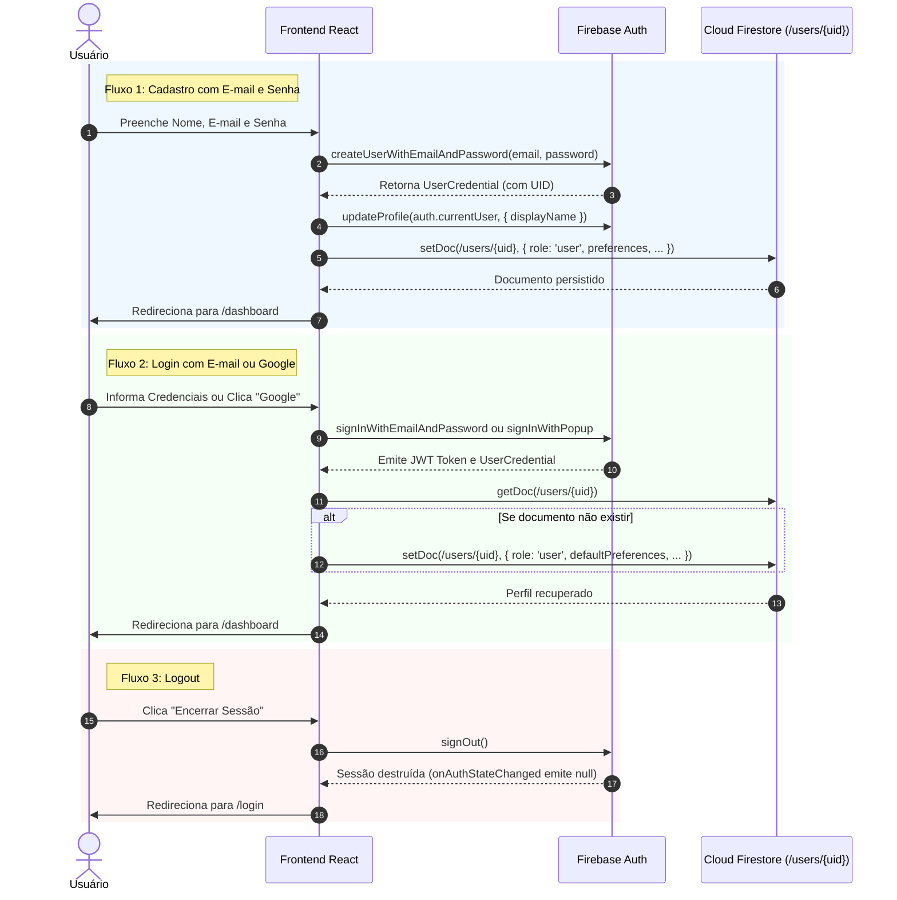

# SPEC TÉCNICA — AUTENTICAÇÃO COM FIREBASE AUTH (SMARTTRIP)

**Código:** SPEC-AUTH-001  
**Versão:** 1.0.0  
**Status:** Homologado para Implementação  
**Escopo:** Fluxos de Autenticação, Ciclo de Vida da Sessão, Perfil em `users/{uid}`, RBAC, Prevenção de Autoelevação e Proteção de Rotas  
**Referências Cruzadas:** [SPEC Mestre](SPEC_MESTRE.md) | [SPEC Técnica Firebase (SPEC-FB-001)](SPEC_INTEGRACAO_FIREBASE.md) | [SPEC Interface (SPEC-UI-001)](SPEC_INTERFACE_BASE.md)  

---

## 1. Visão Geral e Diretrizes de Segurança

O módulo de autenticação do **SmartTrip** é responsável por estabelecer a identidade do viajante, gerenciar a persistência segura de tokens JWT via **Firebase Authentication** e inicializar atomicamente o registro de perfil no **Cloud Firestore** sob o caminho `/users/{uid}`.

### 1.1 Princípios Arquiteturais Inegociáveis
1. **Nenhuma Confiança no Cliente (*Zero Trust Client*):** O sistema nunca aceita um `userId` fornecido arbitrariamente pelo corpo de requisições ou parâmetros de URL. A autoridade de identidade é exclusivamente o token JWT criptograficamente assinado pelo Firebase (`request.auth.uid`).
2. **Papel Padrão e Proibição de Autoelevação (*RBAC*):** Todo usuário é criado obrigatoriamente com o papel `role: 'user'`. O cliente está expressamente proibido de alterar seu próprio campo `role`. Qualquer tentativa de autoelevação para `role: 'admin'` deve ser rejeitada pelas Security Rules do Firestore.
3. **Persistência Local Confiável:** A sessão do usuário é gerenciada com persistência local persistente (`browserLocalPersistence`), suportando recarregamento de página (`F5`), navegação entre abas e renovação automática de token.
4. **Isolamento Estrito entre Contas:** Usuários distintos (ex.: Usuário A e Usuário B) não têm acesso de leitura nem de escrita aos perfis, folgas ou viagens um do outro.

---

## 2. Contratos de Dados e Tipagens TypeScript

```typescript
// src/services/firebase/authTypes.ts

export type UserRole = 'user' | 'admin';

export interface UserPreferencesPayload {
  travelPace: 'slow' | 'moderate' | 'fast';
  interests: string[];
  budgetLevel: 'low' | 'medium' | 'high';
  dietaryRestrictions: string[];
}

export interface UserProfileDocument {
  uid: string;
  email: string;
  displayName: string;
  photoURL: string | null;
  originCity: string;
  role: UserRole; // Sempre 'user' por padrão
  preferences: UserPreferencesPayload;
  createdAt: any; // serverTimestamp()
  updatedAt: any; // serverTimestamp()
}

export interface AuthSessionState {
  user: UserProfileDocument | null;
  firebaseUser: import('firebase/auth').User | null;
  isLoading: boolean;
  isAuthenticated: boolean;
  error: string | null;
}

export interface AuthErrorResponse {
  code: string;
  message: string;
  userFriendlyMessage: string;
}
```

---

## 3. Fluxos de Autenticação Detalhados



### 3.1 Cadastro por E-mail e Senha
1. O usuário submete formulário em `/register`.
2. Validação local: e-mail válido, senha com no mínimo 6 caracteres e confirmação de senha idêntica.
3. Invocação: `createUserWithEmailAndPassword(auth, email, password)`.
4. Atualização imediata do perfil básico de exibição: `updateProfile(user, { displayName })`.
5. **Criação do Perfil no Firestore:** Gravação imediata em `/users/{uid}` definindo compulsoriamente `role: 'user'`, preferências iniciais e `createdAt: serverTimestamp()`.
6. Redirecionamento automático para `/dashboard` (ou `/profile`).

### 3.2 Login por E-mail e Senha
1. O usuário submete credenciais em `/login`.
2. Invocação: `signInWithEmailAndPassword(auth, email, password)`.
3. Em caso de falha, captura e tradução do código de erro (ver Seção 7).
4. Em caso de sucesso, consulta do perfil em `/users/{uid}` e redirecionamento para o destino pretendido.

### 3.3 Login Federado com Google (Google SSO)
1. O usuário clica em "Continuar com o Google" em `/login` ou `/register`.
2. Invocação: `signInWithPopup(auth, new GoogleAuthProvider())`.
3. Idempotência: O sistema consulta `/users/{uid}`. Se o documento ainda não existir, cria o registro com nome, e-mail e avatar fornecidos pelo Google, atribuindo `role: 'user'`.
4. Redirecionamento imediato para `/dashboard`.

### 3.4 Recuperação de Senha
1. O usuário aciona "Esqueceu a senha?" na tela `/login`.
2. O sistema solicita o e-mail cadastrado.
3. Invocação: `sendPasswordResetEmail(auth, email)`.
4. Feedback visual via Toast: "E-mail de recuperação enviado! Verifique sua caixa de entrada e spam."
5. A tela não expõe se o e-mail existe ou não na base para proteção contra enumeração de usuários.

### 3.5 Encerramento de Sessão (Logout)
1. O usuário clica em "Encerrar Sessão" no Header ou na tela `/profile`.
2. Invocação: `signOut(auth)`.
3. Destruição do token em cache local.
4. O listener `onAuthStateChanged` emite `null`, redefinindo o estado global.
5. Redirecionamento forçado para `/login`.

---

## 4. Criação e Inicialização do Perfil em `users/{uid}`

Todo usuário autenticado deve possuir um documento correspondente em `/users/{uid}` com ID idêntico ao seu `uid`.

### 4.1 Schema Rigoroso do Documento `/users/{uid}`

| Campo | Tipo | Descrição | Regra de Criação |
|---|---|---|---|
| `uid` | `string` | UID único gerado pelo Firebase Auth | Obrigatório, imutável |
| `email` | `string` | E-mail verificado da conta | Herda do Firebase Auth |
| `displayName` | `string` | Nome completo ou apelido | Herda do formulário ou Google |
| `photoURL` | `string` ou `null` | URL do avatar | Opcional |
| `originCity` | `string` | Cidade de partida para viagens | Default: `"São Paulo, Brasil"` |
| `role` | `string` | Nível de acesso (`'user'` ou `'admin'`) | **Sempre `'user'` na criação** |
| `preferences` | `map` | Objeto de preferências de viagem | Valores padrão configurados |
| `createdAt` | `FieldValue` | Data/hora do cadastro | `serverTimestamp()` |
| `updatedAt` | `FieldValue` | Data/hora da última alteração | `serverTimestamp()` |

### 4.2 Preferências Padrão na Inicialização
```typescript
const DEFAULT_PREFERENCES: UserPreferencesPayload = {
  travelPace: 'moderate',
  interests: ['Gastronomia', 'Cultura & Museus', 'Caminhadas ao Ar Livre'],
  budgetLevel: 'medium',
  dietaryRestrictions: [],
};
```

---

## 5. Governança de Papéis (RBAC) e Prevenção de Autoelevação

A arquitetura do SmartTrip prevê suporte futuro a funcionalidades administrativas (moderação de conteúdo, análise de métricas, etc.) sem comprometer a segurança atual.

### 5.1 Regras Rígidas de Papéis
* **Papel Padrão:** Todo novo cadastro recebe exclusivamente `role: 'user'`.
* **Proibição de Autoelevação:** Um usuário comum **não pode alterar seu próprio campo `role`**, mesmo que inspecione e manipule a requisição no navegador.
* **Mecanismo Exclusivo de Promoção a Admin:**
  * Promoção via **Firebase Admin SDK** (executado em script protegido com Service Account) ou através de **Custom Claims** criptografadas no token JWT (`request.auth.token.role == 'admin'`).

### 5.2 Validação Declarativa em `firestore.rules`

```javascript
// Trecho de validação em firestore.rules para /users/{userId}
match /users/{userId} {
  // Leitura permitida apenas para o próprio usuário ou admin
  allow read: if request.auth != null && (request.auth.uid == userId || request.auth.token.role == 'admin');

  // Criação: permite apenas se o papel for 'user' (bloqueia criação direta como 'admin')
  allow create: if request.auth != null && 
               request.auth.uid == userId &&
               request.resource.data.role == 'user';

  // Atualização: permite atualizar dados de perfil, MAS impede alteração do campo 'role'
  allow update: if request.auth != null && 
               request.auth.uid == userId &&
               request.resource.data.role == resource.data.role; // O papel DEVE permanecer inalterado
}
```

---

## 6. Prevenção de Confiança no `userId` Enviado pelo Cliente

Uma das vulnerabilidades mais comuns em aplicações web é a aceitação de `userId` enviado no corpo da requisição (`payload.userId = "vitima_123"`).

### 6.1 Contrato de Proteção em Três Camadas
1. **Camada 1 (Frontend):** O cliente preenche o campo `userId` obtendo-o exclusivamente da sessão ativa (`auth.currentUser.uid`).
2. **Camada 2 (Security Rules - Inviolável):** O banco de dados valida compulsoriamente se o dado enviado confere com a assinatura criptográfica do JWT:
   ```javascript
   function incomingUserIdIsCurrent() {
     return request.resource.data.userId == request.auth.uid;
   }
   ```
   Qualquer tentativa de enviar um documento com `userId != request.auth.uid` resulta em erro imediato `PERMISSION_DENIED`.
3. **Camada 3 (Backend / Server Actions):** Em rotas protegidas do servidor, o token JWT do cabeçalho `Authorization: Bearer <token>` é decodificado via `adminAuth.verifyIdToken(token)` e o `decodedToken.uid` é utilizado como a única fonte de verdade.

---

## 7. Dicionário de Códigos e Mensagens de Erro (Firebase Auth)

Erros técnicos nativos do Firebase Auth devem ser interceptados e apresentados ao usuário em português claro, acessível e seguro:

| Código de Erro Firebase | Causa Técnica | Mensagem Amigável Exibida ao Usuário |
|---|---|---|
| `auth/invalid-email` | E-mail malformado ou sem domínio válido | "O endereço de e-mail informado não é válido." |
| `auth/user-disabled` | Conta suspensa administrativamente | "Esta conta de usuário foi desativada temporariamente." |
| `auth/user-not-found` | E-mail inexistente no banco | "E-mail ou senha incorretos. Verifique seus dados." |
| `auth/wrong-password` | Senha incorreta | "E-mail ou senha incorretos. Verifique seus dados." |
| `auth/invalid-credential` | Credenciais incorretas (formato moderno) | "E-mail ou senha incorretos. Verifique seus dados." |
| `auth/email-already-in-use`| Tentativa de cadastrar e-mail já existente | "Já existe uma conta cadastrada com este e-mail. Faça login." |
| `auth/weak-password` | Senha com menos de 6 caracteres | "A senha deve conter no mínimo 6 caracteres." |
| `auth/too-many-requests` | Excesso de tentativas consecutivas | "Muitas tentativas sem sucesso. Aguarde alguns minutos antes de tentar novamente." |
| `auth/popup-closed-by-user`| Usuário fechou o pop-up do Google antes de concluir | "Autenticação com o Google cancelada. Tente novamente." |
| `auth/network-request-failed`| Falha de conexão de internet | "Sem conexão com a internet. Verifique sua rede e tente novamente." |

---

## 8. Proteção de Rotas e Matriz de Redirecionamentos

### 8.1 Matriz de Acesso e Comportamento

| Rota | Classificação | Usuário Anônimo | Usuário Autenticado |
|---|---|---|---|
| `/` | **Pública** | Renderiza normalmente a Landing Page | Renderiza normalmente com botão "Ir para o Dashboard" |
| `/login` | **Pública / Auth** | Renderiza formulário de login | Redireciona imediatamente para `/dashboard` |
| `/register` | **Pública / Auth** | Renderiza formulário de cadastro | Redireciona imediatamente para `/dashboard` |
| `/dashboard` | **Privada** | Redireciona para `/login?redirect=/dashboard` | Renderiza normalmente |
| `/profile` | **Privada** | Redireciona para `/login?redirect=/profile` | Renderiza normalmente |
| `/availability` | **Privada** | Redireciona para `/login?redirect=/availability` | Renderiza normalmente |
| `/explore` | **Privada** | Redireciona para `/login?redirect=/explore` | Renderiza normalmente |
| `/trips` | **Privada** | Redireciona para `/login?redirect=/trips` | Renderiza normalmente |
| `/trips/[id]` | **Privada** | Redireciona para `/login?redirect=/trips/[id]` | Renderiza normalmente (se for dono da viagem) |

### 8.2 Parâmetro `redirect`
Quando um usuário anônimo tenta acessar uma rota protegida (ex: `/trips`), ele é redirecionado para `/login?redirect=/trips`. Após a autenticação com sucesso, a aplicação direciona o usuário de volta para a URL que ele pretendia acessar.

---

## 9. Critérios de Aceite da Autenticação (CA-AUTH)

| ID | Critério de Aceite | Verificação Objetiva |
|:---:|---|---|
| **CA-AUTH-001** | Cadastro por E-mail | Registro com e-mail novo e senha $\ge$ 6 cria o usuário no Auth e o documento `/users/{uid}` com `role: 'user'` e timestamps de servidor. |
| **CA-AUTH-002** | Login por E-mail | Submissão de credenciais válidas gera sessão e atualiza `onAuthStateChanged` para estado autenticado. |
| **CA-AUTH-003** | Google SSO | Fluxo pop-up com conta Google autentica e cria perfil em `/users/{uid}` se for o primeiro acesso. |
| **CA-AUTH-004** | Recuperação de Senha | Informar e-mail no fluxo de redefinição dispara `sendPasswordResetEmail` sem quebrar a tela. |
| **CA-AUTH-005** | Logout e Limpeza de Sessão | Invocação de `signOut` destrói o token local, emite `null` no listener e redireciona para `/login`. |
| **CA-AUTH-006** | Redirecionamento de Rotas Privadas | Acesso anônimo a `/dashboard`, `/trips` ou `/profile` redireciona forçadamente para `/login`. |
| **CA-AUTH-007** | Redirecionamento de Usuário Logado | Acesso de usuário autenticado a `/login` ou `/register` redireciona automaticamente para `/dashboard`. |
| **CA-AUTH-008** | Proibição de Autoelevação | Tentativa de atualizar o campo `role` de `'user'` para `'admin'` via cliente é rejeitada pelo Firestore com erro de permissão. |
| **CA-AUTH-009** | Rejeição de `userId` Falsificado | Tentativa de gravar viagem ou folga com `userId != request.auth.uid` é sumariamente bloqueada com `PERMISSION_DENIED`. |
| **CA-AUTH-010** | Tratamento de Erros Amigáveis | Mensagens de erro de senha incorreta ou e-mail duplicado são exibidas em português claro e acessível. |

---

## 10. Estratégia de Testes e Validação com Dois Usuários Distintos

Para garantir a ausência de vazamento de dados e validar o isolamento estrito entre contas, a suíte de testes deve utilizar dois cenários de personas ativas:

### 10.1 Definição dos Usuários de Teste

```text
USUÁRIO A (Juliana Mendes):
├── UID: "usr_juliana_test_001"
├── E-mail: "juliana.mendes@smarttrip.ai"
├── Role: "user"
└── Documento: /users/usr_juliana_test_001
└── Viagens: /trips/trip_juliana_lisboa (userId: "usr_juliana_test_001")

USUÁRIO B (Lucas Ferreira):
├── UID: "usr_lucas_test_002"
├── E-mail: "lucas.ferreira@smarttrip.ai"
├── Role: "user"
└── Documento: /users/usr_lucas_test_002
└── Viagens: /trips/trip_lucas_buenosaires (userId: "usr_lucas_test_002")
```

### 10.2 Casos de Teste de Isolamento e Permissão (Matriz Cruzada)

| Caso de Teste | Ator | Ação Executada | Resultado Esperado | Validação |
|---|---|---|---|:---:|
| **TC-ISO-01** | Usuário A | Ler documento `/users/usr_juliana_test_001` | **Sucesso (HTTP 200)** | Dados do próprio perfil retornados |
| **TC-ISO-02** | Usuário B | Tentar ler documento `/users/usr_juliana_test_001` | **Rejeitado (`PERMISSION_DENIED`)** | Usuário B não tem acesso ao perfil de A |
| **TC-ISO-03** | Usuário A | Gravar folga com `userId: "usr_juliana_test_001"` | **Sucesso** | Folga gravada na coleção `/timeOffs` |
| **TC-ISO-04** | Usuário B | Tentar gravar folga com `userId: "usr_juliana_test_001"` | **Rejeitado (`PERMISSION_DENIED`)** | Tentativa de falsificar `userId` bloqueada |
| **TC-ISO-05** | Usuário B | Tentar excluir viagem `/trips/trip_juliana_lisboa` | **Rejeitado (`PERMISSION_DENIED`)** | Apenas o dono pode excluir |
| **TC-ISO-06** | Usuário A | Tentar atualizar seu próprio perfil com `role: "admin"` | **Rejeitado (`PERMISSION_DENIED`)** | Regra de autoelevação bloqueia a alteração |
| **TC-ISO-07** | Anônimo | Tentar ler qualquer documento em `/trips` ou `/users` | **Rejeitado (`PERMISSION_DENIED`)** | Bloqueio padrão para não autenticados |
