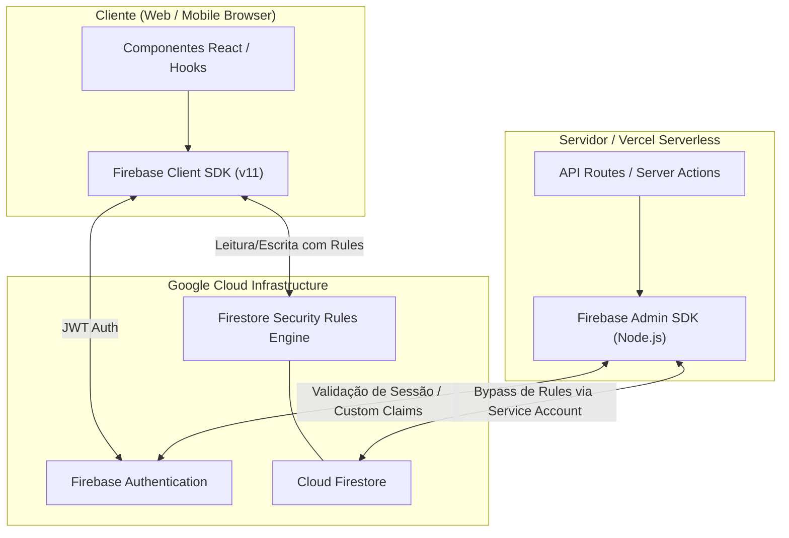

# SPEC TÉCNICA — INTEGRAÇÃO FIREBASE (SMARTTRIP)

**Código:** SPEC-FB-001  
**Versão:** 1.0.0  
**Status:** Homologado para Implementação  
**Escopo:** Arquitetura, Contratos, Segurança, Ciclo de Vida e Inicialização do Firebase Authentication e Cloud Firestore  
**Referências:** [SPEC Mestre](SPEC_MESTRE.md) | [SPEC Operacional](SPEC_OPERACIONAL_INICIALIZACAO.md) | [SPEC Interface](SPEC_INTERFACE_BASE.md)  

---

## 1. Visão Geral e Objetivos da Integração

O ecossistema Firebase é a espinha dorsal de persistência, identidade e autorização do **SmartTrip**. A integração é desenhada para operar em modelo *Serverless-First*, balanceando acesso direto e seguro via **Firebase Client SDK** (protegido por **Security Rules**) com operações privilegiadas no servidor através do **Firebase Admin SDK**.

### Objetivos Principais
* **Autenticação Confiável:** Gerenciamento federado de identidades (Google Sign-In) e tradicional (e-mail/senha) com renovação transparente de tokens JWT.
* **Persistência Reativa e Desacoplada:** Armazenamento em tempo real de preferências, folgas e roteiros de viagem no Cloud Firestore com tipagem estrita via *Data Converters*.
* **Segurança Inegociável:** Garantir que o banco de dados seja inacessível para requisições anônimas e que nenhum usuário possa ler ou adulterar dados de terceiros.
* **Zero Credenciais Expostas:** Separação estrita entre credenciais públicas do cliente e segredos restritos de servidor.

---

## 2. Arquitetura: Firebase Client SDK vs. Firebase Admin SDK

A aplicação utiliza os dois SDKs com propósitos arquiteturais distintos:



### 2.1 Comparativo de Responsabilidades

| Dimensão | Firebase Client SDK | Firebase Admin SDK |
|---|---|---|
| **Ambiente de Execução** | Browser do usuário final (código compilado no bundle do cliente). | Exclusivamente no servidor (Node.js / Vercel Serverless / Server Actions). |
| **Privilégios** | **Restritos:** Opera sob o contexto do usuário autenticado (`request.auth`). | **Elevados (Root/Superuser):** Bypassa integralmente as Security Rules do Firestore. |
| **Segurança e Regras** | Submetido compulsoriamente à validação das **Firestore Security Rules**. | Não passa pelo motor de Security Rules. Toda validação deve ser feita no código backend. |
| **Chaves de Acesso** | Chaves públicas de identificação do projeto (`apiKey`, `appId`). | Chave privada da Conta de Serviço (`serviceAccountKey` ou `PRIVATE_KEY`). |
| **Finalidade no SmartTrip** | Login/logout, escuta de autenticação (`onAuthStateChanged`), leituras e gravações diretas do usuário. | Orquestração do Gemini que requer validação centralizada, migrações de dados, sanitização e moderação. |

---

## 3. Gestão de Variáveis de Ambiente: Públicas vs. Privadas

### 3.1 Classificação Estrutural

```text
VARIÁVEIS DE AMBIENTE
├── PÚBLICAS (Client SDK - Injetadas no Bundle do Navegador)
│   ├── VITE_FIREBASE_API_KEY              (Identificador de cota da API Google)
│   ├── VITE_FIREBASE_AUTH_DOMAIN          (Domínio do fluxo OAuth Google)
│   ├── VITE_FIREBASE_PROJECT_ID           (ID do projeto GCP/Firebase)
│   ├── VITE_FIREBASE_STORAGE_BUCKET       (Bucket do Cloud Storage)
│   ├── VITE_FIREBASE_MESSAGING_SENDER_ID  (ID de mensageria)
│   └── VITE_FIREBASE_APP_ID               (ID do aplicativo web)
│
└── PRIVADAS (Admin SDK - NUNCA expostas no bundle)
    ├── FIREBASE_PROJECT_ID                (ID do projeto para SDK de servidor)
    ├── FIREBASE_CLIENT_EMAIL              (E-mail da service account com papel admin)
    └── FIREBASE_PRIVATE_KEY               (Chave criptográfica privada RSA)
```

### 3.2 Diretrizes de Segurança
1. As variáveis com prefixo `VITE_` ou `NEXT_PUBLIC_` são visíveis inspecionando o código-fonte gerado. Elas identificam o projeto no Firebase, mas **não conferem permissões administrativas**. A proteção dos dados é responsabilidade exclusiva das **Security Rules**.
2. As variáveis privadas da Conta de Serviço (`FIREBASE_PRIVATE_KEY`) **jamais** devem possuir prefixo público. O acesso a elas deve ser encapsulado no servidor.

---

## 4. Inicialização Singleton e Prevenção de Instâncias Duplicadas

No ecossistema React (especialmente em ambientes de desenvolvimento com Hot Module Replacement - HMR e Fast Refresh), chamadas repetidas a `initializeApp` causam a exceção `FirebaseError: Firebase: Firebase App named '[DEFAULT]' already exists`.

### 4.1 Padrão Singleton Verificável (Client SDK)
A inicialização do Client SDK deve verificar se já existe uma aplicação inicializada antes de instanciar uma nova:

```typescript
// Contrato de Inicialização Segura (src/services/firebase/client.ts)
import { initializeApp, getApps, getApp, FirebaseApp } from 'firebase/app';
import { getAuth, Auth } from 'firebase/auth';
import { getFirestore, Firestore } from 'firebase/firestore';

const firebaseConfig = {
  apiKey: import.meta.env.VITE_FIREBASE_API_KEY,
  authDomain: import.meta.env.VITE_FIREBASE_AUTH_DOMAIN,
  projectId: import.meta.env.VITE_FIREBASE_PROJECT_ID,
  storageBucket: import.meta.env.VITE_FIREBASE_STORAGE_BUCKET,
  messagingSenderId: import.meta.env.VITE_FIREBASE_MESSAGING_SENDER_ID,
  appId: import.meta.env.VITE_FIREBASE_APP_ID,
};

// Padrão Singleton: reaproveita instância existente ou inicializa a primeira
export const app: FirebaseApp = getApps().length > 0 ? getApp() : initializeApp(firebaseConfig);
export const auth: Auth = getAuth(app);
export const db: Firestore = getFirestore(app);
```

### 4.2 Padrão Singleton no Servidor (Admin SDK)
No ambiente serverless (Node.js), a inicialização do `firebase-admin` deve seguir a mesma regra para evitar vazamento de memória e conflitos de credenciais:

```typescript
// Contrato de Inicialização do Admin SDK (src/services/firebase/admin.ts)
import admin from 'firebase-admin';

if (!admin.apps.length) {
  admin.initializeApp({
    credential: admin.credential.cert({
      projectId: process.env.FIREBASE_PROJECT_ID,
      clientEmail: process.env.FIREBASE_CLIENT_EMAIL,
      // Tratamento de quebras de linha na chave privada RSA
      privateKey: process.env.FIREBASE_PRIVATE_KEY?.replace(/\\n/g, '\n'),
    }),
  });
}

export const adminDb = admin.firestore();
export const adminAuth = admin.auth();
```

---

## 5. Estratégia Multiambiente (Development / Preview / Production)

A aplicação deve operar de forma isolada em cada ciclo do pipeline de entrega contínua:

| Ambiente | Origem / Branch | Projeto Firebase | Estratégia de Dados |
|---|---|---|---|
| **Development (Local)** | Máquina do desenvolvedor (`localhost:3000`) | `smarttrip-dev` ou Emuladores Locais | Dados de teste, contas descartáveis. |
| **Preview (Vercel PR)** | Pull Requests / Branches de Feature | `smarttrip-dev` ou `smarttrip-staging` | Validação de homologação antes de mesclar na `main`. |
| **Production** | Branch `main` (Domínio de produção) | `smarttrip-prod` | Dados reais, regras de segurança estritas e monitoramento. |

### 5.1 Critérios de Isolamento
* Ambientes de desenvolvimento e preview não compartilham a base do Cloud Firestore da produção.
* As variáveis de ambiente da Vercel devem ser configuradas separadamente para os escopos: **Development**, **Preview** e **Production**.

---

## 6. Especificação do Firebase Authentication

### 6.1 Provedores de Autenticação Suportados no MVP
1. **Google Sign-In (`GoogleAuthProvider`):** Fluxo preferencial por Popup/Redirect sem necessidade de gerenciamento de senhas.
2. **E-mail e Senha (`EmailAuthProvider`):** Registro e login tradicionais com validação mínima de 6 caracteres.

### 6.2 Persistência e Gerenciamento de Estado
* **Persistência:** A sessão deve ser configurada como `browserLocalPersistence` (IndexedDB/LocalStorage), mantendo o usuário autenticado entre abas e recarregamentos.
* **Escuta de Estado (`onAuthStateChanged`):** O estado de login é centralizado em um contexto reativo do React (`AuthContext`), emitindo o usuário atual ou `null`.
* **Sincronização de Perfil:** No primeiro login de um novo UID, o sistema cria automaticamente o documento correspondente em `/users/{uid}` com as preferências padrão de viagem.

---

## 7. Especificação do Cloud Firestore

### 7.1 Coleções, Documentos e Subcoleções

```text
Cloud Firestore Root
├── users/ (Coleção de Perfis)
│   └── {uid}/ (Documento do Usuário - ID idêntico ao UID do Auth)
│       ├── email: string
│       ├── displayName: string
│       ├── photoURL: string (opcional)
│       ├── originCity: string
│       ├── preferences: map (travelPace, interests, budgetLevel, dietaryRestrictions)
│       ├── createdAt: serverTimestamp
│       └── updatedAt: serverTimestamp
│
├── timeOffs/ (Coleção de Períodos de Folga)
│   └── {timeOffId}/ (Auto-ID)
│       ├── userId: string (FK -> users/{uid})
│       ├── title: string
│       ├── startDate: string (ISO YYYY-MM-DD)
│       ├── endDate: string (ISO YYYY-MM-DD)
│       ├── totalDays: number
│       ├── status: string ("upcoming" | "ongoing" | "past")
│       ├── createdAt: serverTimestamp
│       └── updatedAt: serverTimestamp
│
└── trips/ (Coleção de Roteiros de Viagem)
    └── {tripId}/ (Auto-ID)
        ├── userId: string (FK -> users/{uid})
        ├── title: string
        ├── destination: map (name, country, countryCode, latitude, longitude)
        ├── dates: string
        ├── startDate: string (ISO YYYY-MM-DD)
        ├── endDate: string (ISO YYYY-MM-DD)
        ├── daysCount: number
        ├── imageUrl: string
        ├── status: string ("draft" | "confirmed" | "completed")
        ├── weatherSummary: map (avgTemp, condition)
        ├── days: array of maps (dayNumber, dateStr, weekday, title, summary, weather, activities)
        ├── createdAt: serverTimestamp
        └── updatedAt: serverTimestamp
```

### 7.2 Estratégia Mandatória para Timestamps
* **Proibição de Relógio Local do Cliente:** É terminantemente proibido utilizar `new Date()` ou `Date.now()` para preencher os campos `createdAt` ou `updatedAt`.
* **Uso Obrigatório de `serverTimestamp()`:**
  * Criação: `{ createdAt: serverTimestamp(), updatedAt: serverTimestamp() }`
  * Atualização: `{ updatedAt: serverTimestamp() }`
* **Justificativa:** Previne adulteração maliciosa de datas, inconsistências de fuso horário e divergências de relógio entre diferentes dispositivos.

---

## 8. Security Rules do Firestore (Requisito Mandatório)

O banco opera sob a premissa de **negação por padrão** (*Default Deny*). Nenhuma leitura ou escrita anônima é permitida.

### 8.1 Arquivo Oficial: `firestore.rules`

```javascript
rules_version = '2';
service cloud.firestore {
  match /databases/{database}/documents {

    // Função auxiliar: valida se o solicitante está autenticado
    function isAuthenticated() {
      return request.auth != null && request.auth.uid != null;
    }

    // Função auxiliar: valida se o solicitante é o proprietário do documento
    function isOwner(userId) {
      return isAuthenticated() && request.auth.uid == userId;
    }

    // Função auxiliar: valida se o campo userId enviado confere com o solicitante
    function incomingUserIdIsCurrent() {
      return request.resource.data.userId == request.auth.uid;
    }

    // 1. Coleção de Usuários (/users/{userId})
    match /users/{userId} {
      allow read: if isOwner(userId);
      allow create: if isOwner(userId) && request.resource.data.email == request.auth.token.email;
      allow update: if isOwner(userId);
      allow delete: if false; // Exclusão de contas somente via fluxo administrativo/GDPR
    }

    // 2. Coleção de Folgas (/timeOffs/{timeOffId})
    match /timeOffs/{timeOffId} {
      allow read: if isAuthenticated() && resource.data.userId == request.auth.uid;
      allow create: if isAuthenticated() && incomingUserIdIsCurrent();
      allow update: if isAuthenticated() && resource.data.userId == request.auth.uid && incomingUserIdIsCurrent();
      allow delete: if isAuthenticated() && resource.data.userId == request.auth.uid;
    }

    // 3. Coleção de Viagens (/trips/{tripId})
    match /trips/{tripId} {
      allow read: if isAuthenticated() && resource.data.userId == request.auth.uid;
      allow create: if isAuthenticated() && incomingUserIdIsCurrent();
      allow update: if isAuthenticated() && resource.data.userId == request.auth.uid && incomingUserIdIsCurrent();
      allow delete: if isAuthenticated() && resource.data.userId == request.auth.uid;
    }

    // Bloqueio explícito para qualquer outra rota não mapeada
    match /{document=**} {
      allow read, write: if false;
    }
  }
}
```

---

## 9. Firebase Cloud Storage (Tratado Apenas como Extensão)

* **Status no MVP:** O Cloud Storage **não é requisito crítico** da primeira versão. O MVP utiliza URLs seguras de banco de imagens para ilustrar destinos e avatares padrão.
* **Extensão Futura (Pós-MVP):**
  * Finalidade: Upload de fotos de perfil customizadas e imagens enviadas por usuários em viagens.
  * Estrutura de Pastas planejada: `users/{uid}/avatar.jpg` e `trips/{tripId}/photos/{photoId}.jpg`.
  * Regras de Segurança do Storage exigirão validação de tipo MIME (`image/jpeg`, `image/png`, `image/webp`) e limite de tamanho máximo de 5MB por arquivo.

---

## 10. Módulos Conceituais do Projeto

A integração deve ser organizada estritamente dentro da pasta `src/services/firebase/`:

```text
src/services/firebase/
├── client.ts             # Inicialização Singleton do App, Auth e Firestore (Client SDK)
├── auth.ts               # Funções de Login, Registro, Logout e Listener de Sessão
├── firestore.ts          # Operações de CRUD de Usuários, Folgas e Viagens tipadas
├── converters.ts         # Firestore Data Converters para mapear documentos em tipos TS
├── admin.ts              # Inicialização do Admin SDK para execução em API Routes/Server Actions
└── types.ts              # Definições de payloads específicos do Firebase
firestore.rules           # Regras declarativas de segurança versionadas na raiz do projeto
```

---

## 11. Matriz de Riscos Técnicos e Mitigações

| Risco Técnico | Severidade | Probabilidade | Estratégia de Mitigação |
|---|---|---|---|
| **Exposição da chave privada da Service Account** | Crítica | Baixa | Bloqueio de arquivos JSON de credenciais no `.gitignore`, armazenamento exclusivo nas variáveis criptografadas da Vercel. |
| **Erros de Inicialização Duplicada em HMR** | Média | Alta | Utilização do padrão `getApps().length ? getApp() : initializeApp()` em ambos os SDKs. |
| **Inconsistência de fusos horários em datas** | Média | Média | Utilização estrita de `serverTimestamp()` para auditoria e padronização de datas de viagem em formato ISO `YYYY-MM-DD`. |
| **Acesso indevido a dados de outro usuário** | Alta | Média | Implantação e teste automatizado de **Firestore Security Rules** impedindo leitura/escrita cruzada. |
| **Estouro de leituras no Firestore** | Baixa | Média | Estrutura de documentos planos para viagens, evitando consultas em loop e subcoleções excessivas no MVP. |

---

## 12. Critérios de Aceite da Integração Firebase (CA-FB)

| ID | Critério | Verificação |
|:---:|---|---|
| **CA-FB-001** | Inicialização Singleton | O módulo `client.ts` não deve disparar erro de aplicação já existente durante múltiplos re-renders de HMR. |
| **CA-FB-002** | Isolamento de Chaves Privadas | A chave privada do Admin SDK (`FIREBASE_PRIVATE_KEY`) não deve estar presente no bundle estático compilado em `dist/`. |
| **CA-FB-003** | Persistência de Sessão Auth | Ao autenticar e recarregar a página (`F5`), o estado de login deve permanecer ativo via `onAuthStateChanged`. |
| **CA-FB-004** | Integridade do Documento do Usuário | Ao logar pela primeira vez com Google, o documento correspondente deve ser criado em `/users/{uid}` com timestamps de servidor. |
| **CA-FB-005** | Restrição de Leitura Cruzada | Um usuário autenticado com UID `A` não deve conseguir consultar ou modificar documentos cujo campo `userId` seja `B`. |
| **CA-FB-006** | Bloqueio Anônimo Total | Requisições sem cabeçalho/token de autenticação devem ser rejeitadas com erro de permissão negada pelo Firestore. |
| **CA-FB-007** | Timestamps de Servidor | Os campos `createdAt` e `updatedAt` de viagens e folgas devem ser preenchidos obrigatoriamente com `serverTimestamp()`. |

---

## 13. Estratégia de Testes

1. **Testes de Regras de Segurança com Firebase Emulator:**
   * Utilizar a biblioteca `@firebase/rules-unit-testing` para validar que:
     * Usuário `A` consegue ler e gravar seu próprio perfil e suas viagens.
     * Usuário `A` recebe erro `PERMISSION_DENIED` ao tentar ler documentos de `B`.
     * Usuários não autenticados recebem erro em qualquer operação de leitura ou escrita.
2. **Testes de Inicialização e Variáveis de Ambiente:**
   * Teste unitário verificando que o módulo falha de forma graciosa e inteligível caso variáveis obrigatórias não estejam definidas.
3. **Testes de Data Converters:**
   * Garantir que objetos do Firestore convertam `Timestamp` para strings ISO ou objetos Date consumíveis pelo frontend sem quebras de tipagem.
